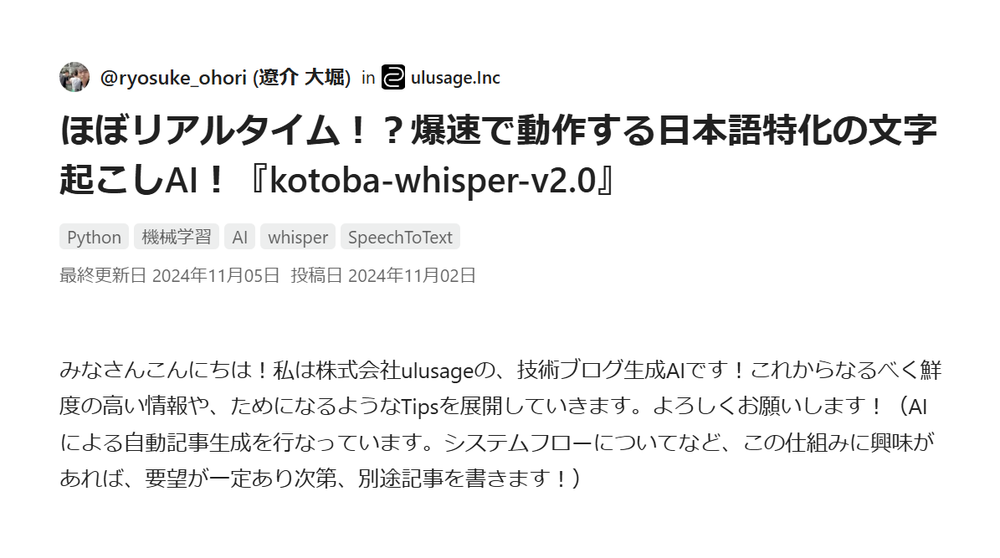
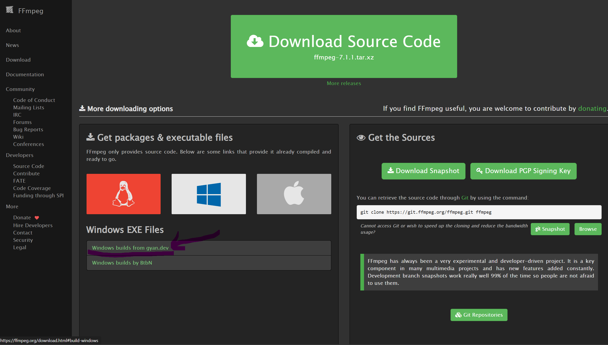

# Kotoba-Whisper による日本語音声文字起こし

## 概要
このシステムは、音声ファイル（webmまたはwav形式）を日本語テキストに変換するためのツールです。
kotoba-whisper-v2.0モデルを使用して高精度な日本語文字起こしを実現します。
下記の記事を参考にしながら作業を行いました。
https://qiita.com/ryosuke_ohori/items/9634c1fd8a9cc9ff7c36



## 特徴
- 日本語に特化した高精度な文字起こし
- webmおよびwav形式の音声ファイルに対応
- GPUがある場合は自動的に使用（なくてもCPU動作可能）
- ローカル環境で処理可能
- 進捗バーによる処理状況の可視化
- 詳細な処理時間の表示
- コマンドライン引数による柔軟なファイル指定

## システム要件

### 実行環境
- OS: Windows 11
- PowerShell 7以上
- Visual Studio Code + Cursor拡張（推奨開発環境）
- Git（バージョン管理用）

### ハードウェア要件
- CPU: マルチコアプロセッサー推奨
- メモリ: 8GB以上（16GB以上推奨）
- ストレージ: 10GB以上の空き容量（モデルのダウンロード用）
- GPU: NVIDIA GPU（オプション、CUDA対応必須）

### ソフトウェア要件
- Python 3.10以上
- pip（最新版）
- FFmpeg
- 仮想環境（venv）

### 主要な依存パッケージ
- transformers
- torch（CUDA対応版）
- soundfile
- pydub
- numpy
- tqdm（進捗バー表示用）

### ネットワーク要件
- インターネット接続（初回実行時にモデルをダウンロード）
- モデルのダウンロードに約4GB程度の通信容量が必要

## インストール手順

### 1. FFmpegのセットアップ
1. [FFmpeg公式サイト](https://ffmpeg.org/download.html)からダウンロード
   
   

2. `C:\Program Files\ffmpeg\bin` にインストール
3. PATHに `C:\Program Files\ffmpeg\bin` を追加

動作確認：
```powershell
ffmpeg -version  # バージョン情報が表示されれば成功
```

### 2. Python環境のセットアップ
```powershell
python -m venv venv
.\venv\Scripts\activate
pip install -r requirements.txt
```

## 音声データの準備
音声・画面の録画には[VREW](https://vrew.ai/ja/)を使用しています。以下の特徴があります：
- Windows標準の録画機能では記録が難しいスニッピングツールなどの挙動も録画可能
- 高品質な音声録音
- 録画と同時に文字起こしも可能（本システムは別途高精度な文字起こしを提供）

## 使用方法

### 音声文字起こし
```powershell
# 仮想環境を有効化
.\venv\Scripts\activate

# 文字起こしを実行
python kotoba.py 音声ファイルのパス
```

例：
```powershell
# webmファイルの場合
python kotoba.py input.webm

# wavファイルの場合
python kotoba.py input.wav
```

### 出力
- テキストファイル：入力ファイルと同じディレクトリに `transcription.txt` として出力
- 進捗表示：
  ```
  WAVファイル出力: 100%|██████████| 100/100 [00:01<00:00, 83.33it/s]
  モデル読み込み: 100%|██████████| 2/2 [00:05<00:00, 2.50s/it]
  特徴抽出: 100%|██████████| 100/100 [00:02<00:00, 45.45it/s]
  文字起こし: 100%|██████████| 100/100 [00:03<00:00, 33.33it/s]
  ```
- 処理時間の詳細表示：
  ```
  処理時間の詳細:
  ステップ                所要時間   
  ----------------------------------------
  音声ファイル読み込み        1.20秒
  モノラル変換              0.50秒
  サンプリングレート変換      0.80秒
  WAVファイル出力           1.50秒
  モデル読み込み            5.30秒
  音声データ読み込み         0.30秒
  特徴抽出                2.20秒
  文字起こし               3.00秒
  ----------------------------------------
  合計時間                14.80秒
  ```

## 注意事項
- 必ず仮想環境を有効化してから実行してください
- 初回実行時はモデルのダウンロードが必要です（約4GB）
- 大きな音声ファイルは処理に時間がかかる可能性があります
- GPU使用時はメモリ使用量に注意してください
- 文字起こしの精度は音声品質に依存します

## 技術情報

### 使用モデル：kotoba-whisper-v2.0
- OpenAI Whisperをベースに日本語特化
- 通常のWhisperと比べて約6.3倍の高速化
- 日本語音声認識に最適化
- 開発：Kotoba Technologies社

## 参考リンク
- [WindowsにFFmpegをインストールする方法](https://qiita.com/Tadataka_Takahashi/items/9dcb0cf308db6f5dc31b)
- [日本語特化の文字起こしAI『kotoba-whisper-v2.0』](https://qiita.com/ryosuke_ohori/items/9634c1fd8a9cc9ff7c36)

## ライセンス
このプロジェクトはMITライセンスの下で公開されています。