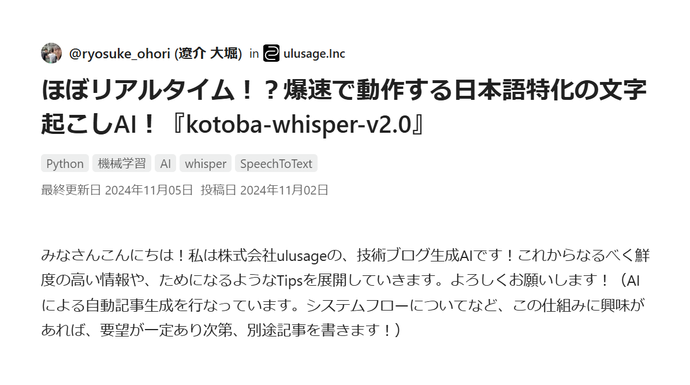
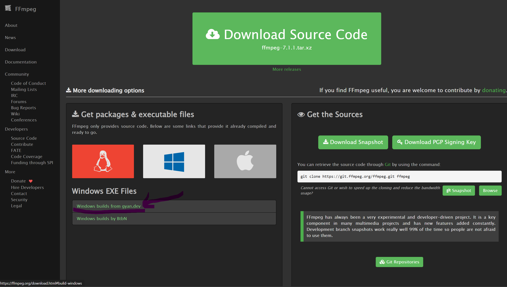

# 音声文字起こしシステム

## 概要
このシステムは、音声ファイル（webm形式）を日本語テキストに変換するためのツールです。
kotoba-whisper-v2.0モデルを使用して高精度な日本語文字起こしを実現します。



## 特徴
- 日本語に特化した高精度な文字起こし
- webm形式の音声ファイルに対応
- GPUがある場合は自動的に使用（なくてもCPU動作可能）
- ローカル環境で処理可能

## システム要件
- Python 3.10以上
- FFmpeg
- 仮想環境（venv）
- NVIDIA GPU（オプション）

## インストール手順

### 1. FFmpegのセットアップ
1. [FFmpeg公式サイト](https://ffmpeg.org/download.html)からダウンロード
   
   

2. `C:\Program Files\ffmpeg\bin` にインストール
3. PATHに `C:\Program Files\ffmpeg\bin` を追加

動作確認：
```bash
ffmpeg -version  # バージョン情報が表示されれば成功
```

トラブルシューティング：
- PATHが認識されない場合は以下のいずれかで対処
  1. `C:\Program Files\ffmpeg\bin` にインストール（推奨）
  2. コードでフルパスを指定：
     ```python
     AudioSegment.converter = r"C:\FFmpeg\bin\ffmpeg.exe"
     AudioSegment.ffmpeg = r"C:\FFmpeg\bin\ffmpeg.exe"
     AudioSegment.ffprobe = r"C:\FFmpeg\bin\ffprobe.exe"
     ```

### 2. Python環境のセットアップ
```bash
python -m venv venv
.\venv\Scripts\activate
pip install -r requirements.txt
```

## 使用方法

### 1. 準備
- 音声ファイルを `record.webm` という名前で保存
- プロジェクトのルートディレクトリに配置

### 2. 音声変換
```bash
.\venv\Scripts\activate  # 仮想環境を有効化
python convert_audio.py
```
出力：
- ファイル：`record.wav`
- 成功時：「Conversion completed successfully!」と表示

### 3. 文字起こし
```bash
python transcribe_test.py
```
出力：
- ファイル：`transcription.txt`
- 処理時間：CPUモードで約9秒
- 成功時：「Transcription completed」と表示

## 注意事項
- 必ず仮想環境を有効化してから実行
- ファイル名は固定（`record.webm` → `record.wav` → `transcription.txt`）
- 大きな音声ファイルは処理に時間がかかる可能性あり
- 文字起こしの精度は音声品質に依存

## 技術情報

### 使用モデル：kotoba-whisper-v2.0
- OpenAI Whisperをベースに日本語特化
- 通常のWhisperと比べて約6.3倍の高速化
- 日本語音声認識に最適化
- 開発：Kotoba Technologies社

### トラブルシューティング
1. FFmpeg関連
   - PATHの設定を確認
   - PowerShellを再起動
   - PCの再起動

2. Python関連
   - 仮想環境の有効化確認
   - `pip install -r requirements.txt` の再実行

3. CUDA関連
   - GPUドライバーの更新確認
   - CUDA Toolkitの確認

## 参考リンク
- [WindowsにFFmpegをインストールする方法](https://qiita.com/Tadataka_Takahashi/items/9dcb0cf308db6f5dc31b)
- [日本語特化の文字起こしAI『kotoba-whisper-v2.0』](https://qiita.com/ryosuke_ohori/items/9634c1fd8a9cc9ff7c36)

## ライセンス
このプロジェクトはMITライセンスの下で公開されています。